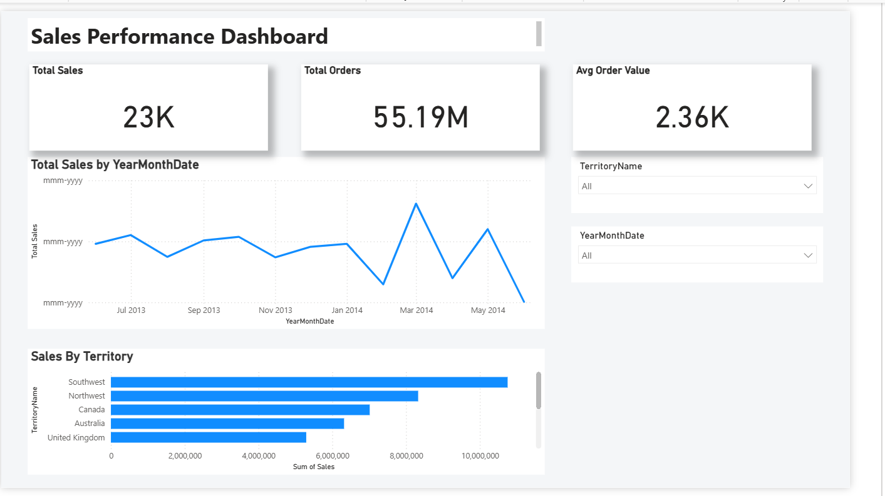
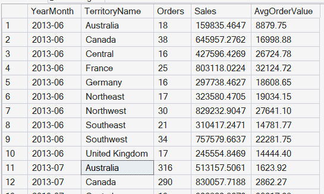

# AdventureWorks Sales Performance Dashboard

## Overview

This project presents an executive-level Sales Performance Dashboard built in Power BI using the AdventureWorks 2016 sample database.

The dashboard provides a structured, interactive view of revenue trends, order activity, and regional performance. It is designed with a clean executive layout that emphasizes clarity, hierarchy, and professional presentation standards.

---

## Screenshots

### Power BI Dashboard



---

### SQL Result Rows (Dataset Preview)



---

## Business Objectives

This dashboard enables users to:

- Analyze overall sales performance
- Track monthly revenue trends
- Compare territory-level performance
- Monitor order volume
- Evaluate average order value
- Interactively filter results by territory and month

---

## Data Source

- AdventureWorks 2016 Sample Database  
- Microsoft SQL Server  

---

## SQL Data Preparation

The dataset was generated using a SQL query that:

- Joins `SalesOrderHeader` with `SalesTerritory`
- Aggregates total sales and order counts
- Calculates average order value
- Anchors the time window to the latest available data in the database
- Groups results by Year-Month and Territory

The SQL query used to generate the dataset is included in the `/sql` directory.

---

## Power BI Modeling Approach

### DAX Measures

```DAX
Total Sales = SUM(Query1[Sales])

Total Orders = SUM(Query1[Orders])

Avg Order Value = DIVIDE([Total Sales], [Total Orders])
